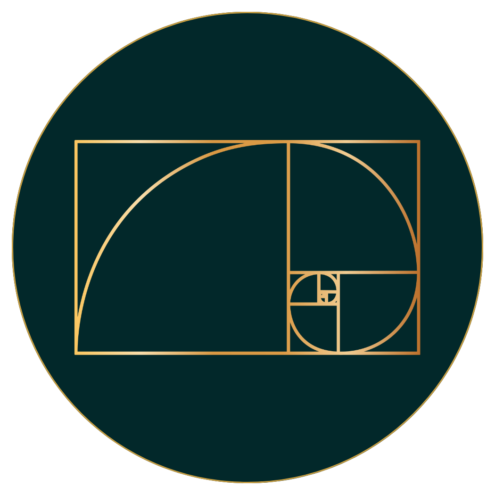

<h1 align="center">Hi 👋, I'm Edizon Leal</h1>
<h3 align="center">Founder of Áurea Web | Full-Stack Developer</h3>

**I specialize in building high-value websites, using modern open-source technologies to deliver scalable, efficient, and business-oriented solutions.**
**One of my long-term goals is to train and establish myself as a professional game developer.**

- 💼 **Founder of Áurea Web:** I develop professional solutions for small and medium-sized businesses, including Landing Pages, E-commerce, Product Catalogs, and Corporate Blogs.
- 🛠 **Web Stack:** I currently build robust web applications using **React.js** (Frontend) and **Django** (Backend).
- 🦀 **Performance Focus:** I am implementing high-performance backend systems using **Rust** with the **Axum** framework.
- 🎮 **Passion Project:** I am actively pursuing my dream of game development, creating projects with **Godot Engine**.

- 📫 **Contact me:** **edimez14@gmail.com**

<h3 align="left">Connect with me:</h3>

<h3 align="left">Languages and Tools:</h3>

	
	
    
	
	  
	 

